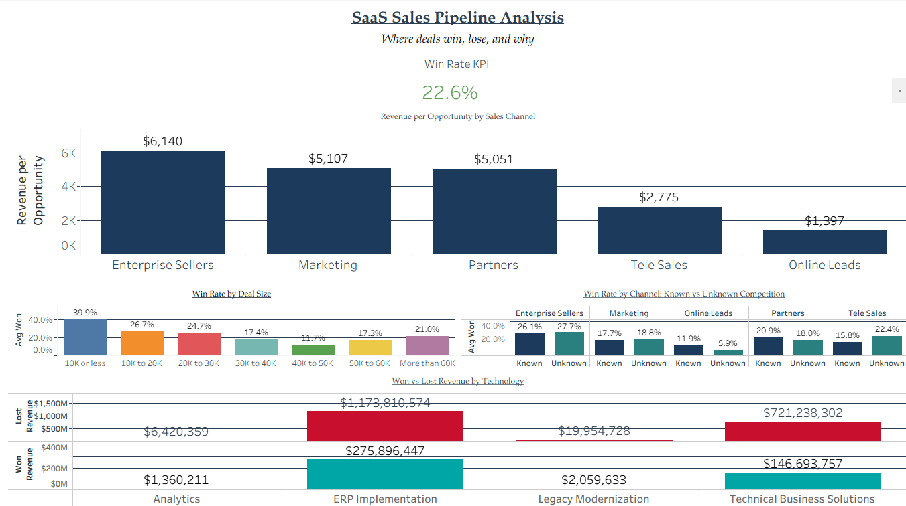

# # SaaS Sales Pipeline Analysis

**Tools:** Python (pandas) · SQLite · SQL · Tableau  
**Dashboard:** [View on Tableau Public](https://public.tableau.com/app/profile/bryce.gardner/viz/SaaS_Sales_Funnel_Analysis/SaaSSalesFunnelAnalysis)

> This is Project 2 of 3 in a SaaS Analytics series exploring churn, sales pipeline performance, and MRR growth cohort analysis.

---

## Data

Raw data not included in this repo due to file size.  
Download from Kaggle: [Sales Pipeline Conversion at a SaaS Startup](https://www.kaggle.com/datasets/soumyadipmondal/sales-pipeline-conversion-at-a-saas-startup)

---

---

## Overview

Every B2B SaaS company runs deals through a pipeline — but not every channel, deal size, or technology line converts the same way. This project analyzes 78,000+ sales opportunities to understand not just *who wins*, but where the business should actually be focusing its sales effort and budget.

**The headline finding:** Win rate alone is misleading. When you reframe the data around *revenue generated per opportunity worked*, the real priorities shift.

---

## The Data

- **Source:** [Kaggle — Sales Pipeline Conversion at a SaaS Startup](https://www.kaggle.com/datasets/soumyadipmondal/sales-pipeline-conversion-at-a-saas-startup)
- **Size:** 78,025 closed opportunities (Won or Loss)
- **Fields:** Technology, City, B2B Sales Medium, Sales Velocity, Opportunity Status, Sales Stage Iterations, Opportunity Size, Client Revenue/Employee Sizing, Compete Intel, Opportunity Sizing

---

## Process

| Step | File | Description |
|------|------|-------------|
| 1 | `01_explore.py` | Initial data load, shape, nulls, value counts |
| 2 | `02_clean.py` | Fix column names, fill missing Compete Intel, create binary Won flag |
| 3 | `03_analyze.py` | Win rate by channel, technology, deal size, and competitive presence |
| 4 | `04_load_sqlite.py` | Load cleaned data into SQLite database |
| 5 | `05_queries.py` | SQL business questions — revenue efficiency, deal size patterns, channel performance |
| 6 | `06_tableau_export.py` | Final export with calculated fields for dashboard |

---

## Key Findings

### 1. Revenue Per Opportunity Reveals the Real Priority Channel
| Channel | Win Rate | Revenue per Opportunity |
|---------|----------|--------------------------|
| Enterprise Sellers | 27.6% | $6,140 |
| Marketing | 18.6% | $5,107 |
| Partners | 18.5% | $5,051 |
| Tele Sales | 21.9% | $2,775 |
| Online Leads | 6.5% | $1,397 |

Win rate alone makes Enterprise Sellers look only moderately better than other channels. But measured by **revenue generated per opportunity worked**, Enterprise Sellers produce over **4x** the value of Online Leads. This is the metric that should drive sales headcount and budget allocation — not win rate in isolation.

### 2. Mid-Size Deals Are the Weakest Segment
| Deal Size | Win Rate |
|-----------|----------|
| 10K or less | 39.9% |
| 10K to 20K | 26.7% |
| 20K to 30K | 24.7% |
| 30K to 40K | 17.4% |
| 40K to 50K | 11.7% |
| 50K to 60K | 17.3% |
| More than 60K | 21.0% |

Win rate is not linear with deal size. Small deals close easily, but the **$40-50K range converts worst of any segment** at 11.7% — even lower than deals over $60K. This points to a pricing or proposal friction point specifically in the mid-market range, not a simple "bigger deals are harder" pattern.

### 3. Known Competition Hurts — Except in One Channel
Across Enterprise Sellers, Marketing, Partners, and Tele Sales, deals with known competitive presence consistently close at a lower rate than deals without known competition. Online Leads is the exception — known competition actually closes better (11.9%) than unknown (5.9%), though this is based on a small sample (only 619 total Online Leads opportunities) and shouldn't be over-interpreted.

### 4. ERP Implementation Dominates Both Wins and Losses
| Technology | Total Opportunities | Win Rate | Won Revenue |
|------------|---------------------|----------|-------------|
| ERP Implementation | 49,810 | 23.3% | $275.9M |
| Technical Business Solutions | 27,325 | 21.4% | $146.7M |
| Legacy Modernization | 609 | 12.2% | $2.1M |
| Analytics | 281 | 26.3% | $1.4M |

ERP Implementation represents the overwhelming majority of both pipeline volume and revenue — nearly two-thirds of all won dollars. Any process improvement in this technology line has an outsized impact compared to the smaller categories.

### 5. More Sales Stage Iterations Correlate With Winning, Not Losing
Won deals average **3.21** stage iterations versus **2.88** for lost deals. This runs counter to the assumption that excessive back-and-forth signals a deal in trouble — instead, it suggests deals that keep moving through the pipeline (continued engagement) are more likely to close, while lost deals may stall out early rather than dragging on.

---

## Business Recommendations

1. **Reallocate budget toward Enterprise Sellers.** Revenue per opportunity is the clearer signal than win rate alone — Enterprise Sellers generate over 4x the value of Online Leads per deal worked.
2. **Investigate the $40-50K pricing gap.** This segment underperforms every neighboring deal-size bucket and warrants a closer look at proposal structure or pricing strategy.
3. **Treat early-stage stalling as the real warning sign**, not high iteration count. Deals that keep moving are more likely to close.
4. **Prioritize ERP Implementation process improvements.** It drives the largest share of both pipeline and revenue, making it the highest-leverage area for sales enablement investment.

---

## Dashboard

Built in Tableau Public with 5 views:
- Overall Win Rate KPI
- Revenue per Opportunity by Sales Channel
- Win Rate by Deal Size
- Win Rate by Channel: Known vs Unknown Competition
- Won vs Lost Revenue by Technology

[**View the full interactive dashboard →**](https://public.tableau.com/app/profile/bryce.gardner/viz/SaaS_Sales_Funnel_Analysis/SaaSSalesFunnelAnalysis)

---

## SaaS Analytics Series

| Project | Description | Tools | Dashboard |
|---------|-------------|-------|-----------|
| **01 — SaaS Churn Analysis** | Identifying who churns, why, and the revenue impact | Python · SQL · Tableau | [View](https://public.tableau.com/app/profile/bryce.gardner/viz/SaaS_Churn/SaaSChurnAnalysis) |
| **02 — SaaS Sales Pipeline Analysis** *(this project)* | Win/loss patterns across channels, deal sizes, and technology lines | Python · SQL · Tableau | [View](https://public.tableau.com/app/profile/bryce.gardner/viz/SaaS_Sales_Funnel_Analysis/SaaSSalesFunnelAnalysis) |
| **03 — MRR Growth & Cohort Analysis** | Monthly recurring revenue trends and customer cohort retention | Python · SQL · Tableau | *Coming soon* |
